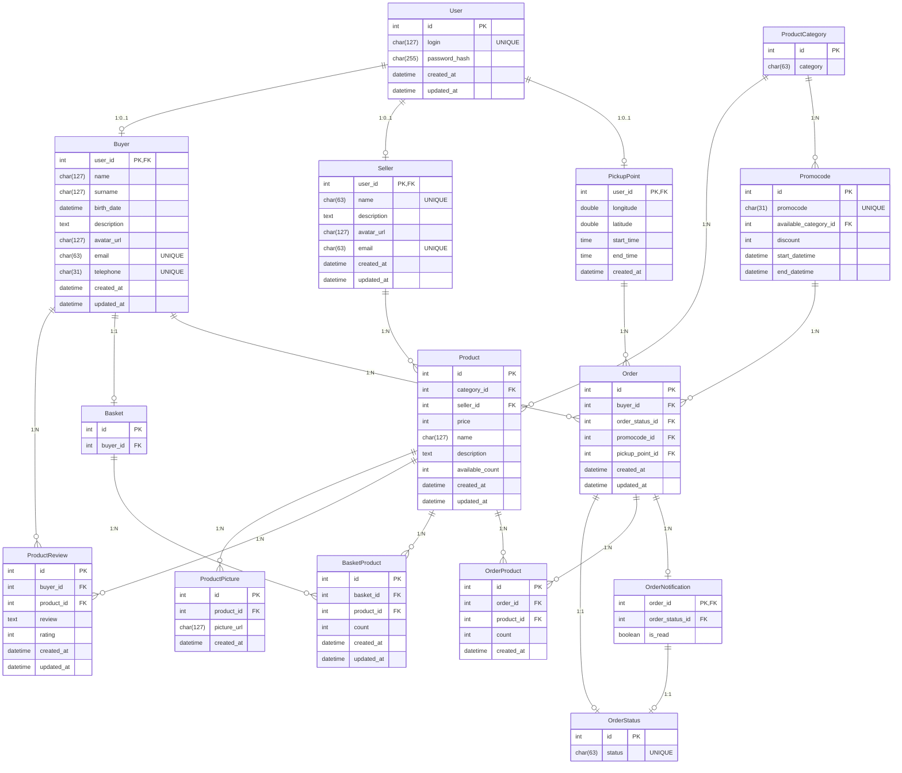

```mermaid
erDiagram
    User ||--o| Buyer : "1:0..1"
    User ||--o| Seller : "1:0..1"
    User ||--o| PickupPoint : "1:0..1"

    Seller ||--o{ Product : "1:N"
    ProductCategory ||--o{ Product : "1:N"
    Product ||--o{ ProductPicture : "1:N"
    
    Buyer ||--o{ ProductReview : "1:N"
    Product ||--o{ ProductReview : "1:N"

    Buyer ||--o| Basket : "1:1"
    Basket ||--o{ BasketProduct : "1:N"
    Product ||--o{ BasketProduct : "1:N"

    ProductCategory ||--o{ Promocode : "1:N"
    
    Buyer ||--o{ Order : "1:N"
    Order ||--o| OrderStatus : "1:1"
    Promocode ||--o{ Order : "1:N"
    PickupPoint ||--o{ Order : "1:N"
    Order ||--o{ OrderProduct : "1:N"
    Product ||--o{ OrderProduct : "1:N"
    Order ||--o| OrderNotification : "1:N"
    OrderNotification ||--o| OrderStatus : "1:1"

    User {
        int id PK
        char(127) login "UNIQUE"
        char(255) password_hash
        datetime created_at
        datetime updated_at
    }

    Buyer {
        int user_id PK, FK
        char(127) name
        char(127) surname
        datetime birth_date
        text description
        char(127) avatar_url
        char(63) email "UNIQUE"
        char(31) telephone "UNIQUE"
        datetime created_at
        datetime updated_at
    }

    Seller {
        int user_id PK, FK
        char(63) name "UNIQUE"
        text description
        char(127) avatar_url
        char(63) email "UNIQUE"
        datetime created_at
        datetime updated_at
    }

    ProductCategory {
        int id PK
        char(63) category
    }

    Product {
        int id PK
        int category_id FK
        int seller_id FK
        int price
        char(127) name
        text description
        int available_count
        datetime created_at
        datetime updated_at
    }

    ProductPicture {
        int id PK
        int product_id FK
        char(127) picture_url
        datetime created_at
    }

    ProductReview {
        int id PK
        int buyer_id FK
        int product_id FK
        text review
        int rating
        datetime created_at
        datetime updated_at
    }

    Basket {
        int id PK
        int buyer_id FK
    }

    BasketProduct {
        int id PK
        int basket_id FK
        int product_id FK
        int count
        datetime created_at
        datetime updated_at
    }

    OrderStatus {
        int id PK
        char(63) status "UNIQUE"
    }

    Promocode {
        int id PK
        char(31) promocode "UNIQUE"
        int available_category_id FK
        int discount
        datetime start_datetime
        datetime end_datetime
    }

    PickupPoint {
        int user_id PK, FK
        double longitude
        double latitude
        time start_time
        time end_time
        datetime created_at
    }

    Order {
        int id PK
        int buyer_id FK
        int order_status_id FK
        int promocode_id FK
        int pickup_point_id FK
        datetime created_at
        datetime updated_at
    }

    OrderProduct {
        int id PK
        int order_id FK
        int product_id FK
        int count
        datetime created_at
    }

    OrderNotification {
        int order_id PK, FK
        int order_status_id FK
        boolean is_read
    }
```