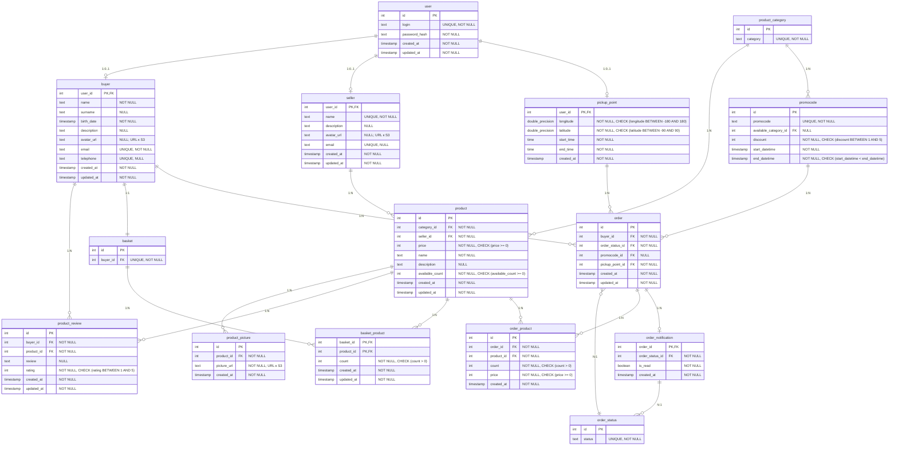

```mermaid
erDiagram
    user ||--o| buyer : "1:0..1"
    user ||--o| seller : "1:0..1"
    user ||--o| pickup_point : "1:0..1"

    seller ||--o{ product : "1:N"
    product_category ||--o{ product : "1:N"
    product ||--o{ product_picture : "1:N"
    
    buyer ||--o{ product_review : "1:N"
    product ||--o{ product_review : "1:N"

    buyer ||--|| basket : "1:1"
    basket ||--o{ basket_product : "1:N"
    product ||--o{ basket_product : "1:N"

    product_category ||--o{ promocode : "1:N"
    
    buyer ||--o{ order : "1:N"
    order }o--|| order_status : "N:1"
    promocode ||--o{ order : "1:N"
    pickup_point ||--o{ order : "1:N"
    order ||--o{ order_product : "1:N"
    product ||--o{ order_product : "1:N"
    order ||--o| order_notification : "1:N"
    order_notification ||--o{ order_status : "N:1"

    user {
        int id PK
        text login "UNIQUE, NOT NULL"
        text password_hash "NOT NULL"
        timestamp created_at "NOT NULL"
        timestamp updated_at "NOT NULL"
    }

    buyer {
        int user_id PK, FK
        text name "NOT NULL"
        text surname "NULL"
        timestamp birth_date "NOT NULL"
        text description "NULL"
        text avatar_url "NULL; URL к S3"
        text email "UNIQUE, NOT NULL"
        text telephone "UNIQUE, NULL"
        timestamp created_at "NOT NULL"
        timestamp updated_at "NOT NULL"
    }

    seller {
        int user_id PK, FK
        text name "UNIQUE, NOT NULL"
        text description "NULL"
        text avatar_url "NULL; URL к S3"
        text email "UNIQUE, NULL"
        timestamp created_at "NOT NULL"
        timestamp updated_at "NOT NULL"
    }

    product_category {
        int id PK
        text category "UNIQUE, NOT NULL"
    }

    product {
        int id PK
        int category_id FK "NOT NULL"
        int seller_id FK "NOT NULL"
        int price "NOT NULL, CHECK (price >= 0)"
        text name "NOT NULL"
        text description "NULL"
        int available_count "NOT NULL, CHECK (available_count >= 0)"
        timestamp created_at "NOT NULL"
        timestamp updated_at "NOT NULL"
    }

    product_picture {
        int id PK
        int product_id FK "NOT NULL"
        text picture_url "NOT NULL; URL к S3"
        timestamp created_at "NOT NULL"
    }

    product_review {
        int id PK
        int buyer_id FK "NOT NULL"
        int product_id FK "NOT NULL"
        text review "NULL"
        int rating "NOT NULL, CHECK (rating BETWEEN 1 AND 5)"
        timestamp created_at "NOT NULL"
        timestamp updated_at "NOT NULL"
    }

    basket {
        int id PK
        int buyer_id FK "UNIQUE, NOT NULL"
    }

    basket_product {
        int basket_id PK, FK
        int product_id PK, FK
        int count "NOT NULL, CHECK (count > 0)"
        timestamp created_at "NOT NULL"
        timestamp updated_at "NOT NULL"
    }

    order_status {
        int id PK
        text status "UNIQUE, NOT NULL"
    }

    promocode {
        int id PK
        text promocode "UNIQUE, NOT NULL"
        int available_category_id FK "NULL"
        int discount "NOT NULL, CHECK (discount BETWEEN 1 AND 5)"
        timestamp start_datetime "NOT NULL"
        timestamp end_datetime "NOT NULL, CHECK (start_datetime < end_datetime)"
    }

    pickup_point {
        int user_id PK, FK
        double_precision longitude "NOT NULL, CHECK (longitude BETWEEN -180 AND 180)"
        double_precision latitude "NOT NULL, CHECK (latitude BETWEEN -90 AND 90)"
        time start_time "NOT NULL"
        time end_time "NOT NULL"
        timestamp created_at "NOT NULL"
    }

    order {
        int id PK
        int buyer_id FK "NOT NULL"
        int order_status_id FK "NOT NULL"
        int promocode_id FK "NULL"
        int pickup_point_id FK "NOT NULL"
        timestamp created_at "NOT NULL"
        timestamp updated_at "NOT NULL"
    }

    order_product {
        int id PK
        int order_id FK "NOT NULL"
        int product_id FK "NOT NULL"
        int count "NOT NULL, CHECK (count > 0)"
        int price "NOT NULL, CHECK (price >= 0)"
        timestamp created_at "NOT NULL"
    }

    order_notification {
        int order_id PK, FK
        int order_status_id FK "NOT NULL"
        boolean is_read "NOT NULL"
        timestamp created_at "NOT NULL"
    }
```