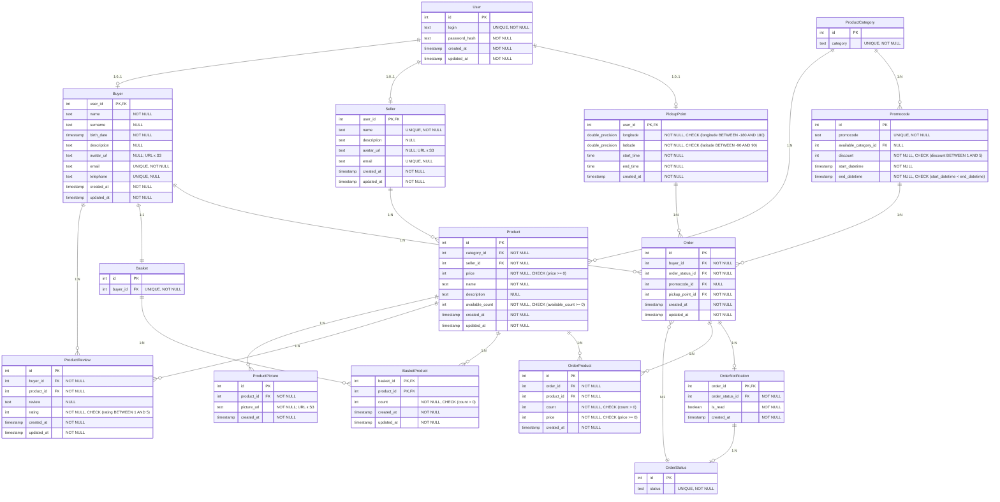

```mermaid
erDiagram
    User ||--o| Buyer : "1:0..1"
    User ||--o| Seller : "1:0..1"
    User ||--o| PickupPoint : "1:0..1"

    Seller ||--o{ Product : "1:N"
    ProductCategory ||--o{ Product : "1:N"
    Product ||--o{ ProductPicture : "1:N"
    
    Buyer ||--o{ ProductReview : "1:N"
    Product ||--o{ ProductReview : "1:N"

    Buyer ||--|| Basket : "1:1"
    Basket ||--o{ BasketProduct : "1:N"
    Product ||--o{ BasketProduct : "1:N"

    ProductCategory ||--o{ Promocode : "1:N"
    
    Buyer ||--o{ Order : "1:N"
    Order }o--|| OrderStatus : "N:1"
    Promocode ||--o{ Order : "1:N"
    PickupPoint ||--o{ Order : "1:N"
    Order ||--o{ OrderProduct : "1:N"
    Product ||--o{ OrderProduct : "1:N"
    Order ||--o| OrderNotification : "1:N"
    OrderNotification ||--o| OrderStatus : "1:N"

    User {
        int id PK
        text login "UNIQUE, NOT NULL"
        text password_hash "NOT NULL"
        timestamp created_at "NOT NULL"
        timestamp updated_at "NOT NULL"
    }

    Buyer {
        int user_id PK, FK
        text name "NOT NULL"
        text surname "NULL"
        timestamp birth_date "NOT NULL"
        text description "NULL"
        text avatar_url "NULL; URL к S3"
        text email "UNIQUE, NOT NULL"
        text telephone "UNIQUE, NULL"
        timestamp created_at "NOT NULL"
        timestamp updated_at "NOT NULL"
    }

    Seller {
        int user_id PK, FK
        text name "UNIQUE, NOT NULL"
        text description "NULL"
        text avatar_url "NULL; URL к S3"
        text email "UNIQUE, NULL"
        timestamp created_at "NOT NULL"
        timestamp updated_at "NOT NULL"
    }

    ProductCategory {
        int id PK
        text category "UNIQUE, NOT NULL"
    }

    Product {
        int id PK
        int category_id FK "NOT NULL"
        int seller_id FK "NOT NULL"
        int price "NOT NULL, CHECK (price >= 0)"
        text name "NOT NULL"
        text description "NULL"
        int available_count "NOT NULL, CHECK (available_count >= 0)"
        timestamp created_at "NOT NULL"
        timestamp updated_at "NOT NULL"
    }

    ProductPicture {
        int id PK
        int product_id FK "NOT NULL"
        text picture_url "NOT NULL; URL к S3"
        timestamp created_at "NOT NULL"
    }

    ProductReview {
        int id PK
        int buyer_id FK "NOT NULL"
        int product_id FK "NOT NULL"
        text review "NULL"
        int rating "NOT NULL, CHECK (rating BETWEEN 1 AND 5)"
        timestamp created_at "NOT NULL"
        timestamp updated_at "NOT NULL"
    }

    Basket {
        int id PK
        int buyer_id FK "UNIQUE, NOT NULL"
    }

    BasketProduct {
        int basket_id PK, FK
        int product_id PK, FK
        int count "NOT NULL, CHECK (count > 0)"
        timestamp created_at "NOT NULL"
        timestamp updated_at "NOT NULL"
    }

    OrderStatus {
        int id PK
        text status "UNIQUE, NOT NULL"
    }

    Promocode {
        int id PK
        text promocode "UNIQUE, NOT NULL"
        int available_category_id FK "NULL"
        int discount "NOT NULL, CHECK (discount BETWEEN 1 AND 5)"
        timestamp start_datetime "NOT NULL"
        timestamp end_datetime "NOT NULL, CHECK (start_datetime < end_datetime)"
    }

    PickupPoint {
        int user_id PK, FK
        double_precision longitude "NOT NULL, CHECK (longitude BETWEEN -180 AND 180)"
        double_precision latitude "NOT NULL, CHECK (latitude BETWEEN -90 AND 90)"
        time start_time "NOT NULL"
        time end_time "NOT NULL"
        timestamp created_at "NOT NULL"
    }

    Order {
        int id PK
        int buyer_id FK "NOT NULL"
        int order_status_id FK "NOT NULL"
        int promocode_id FK "NULL"
        int pickup_point_id FK "NOT NULL"
        timestamp created_at "NOT NULL"
        timestamp updated_at "NOT NULL"
    }

    OrderProduct {
        int id PK
        int order_id FK "NOT NULL"
        int product_id FK "NOT NULL"
        int count "NOT NULL, CHECK (count > 0)"
        int price "NOT NULL, CHECK (price >= 0)"
        timestamp created_at "NOT NULL"
    }

    OrderNotification {
        int order_id PK, FK
        int order_status_id FK "NOT NULL"
        boolean is_read "NOT NULL"
        timestamp created_at "NOT NULL"
    }
```