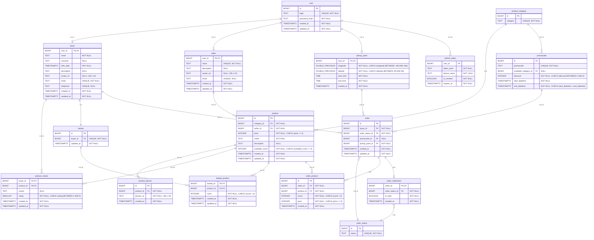

```mermaid
erDiagram
    user ||--o| buyer : "1:0..1"
    user ||--o| seller : "1:0..1"
    user ||--o| pickup_point : "1:0..1"
    user ||--o{ refresh_token : "1:0..N"

    seller ||--o{ product : "1:0..N"
    product_category ||--o{ product : "1:N"
    product ||--o{ product_picture : "1:0..N"
    
    buyer ||--o{ product_review : "1:0..N"
    product ||--o{ product_review : "1:0..N"

    buyer ||--|| basket : "1:1"
    basket ||--o{ basket_product : "1:0..N"
    product ||--o{ basket_product : "1:0..N"

    product_category ||--o{ promocode : "1:0..N"
    
    buyer ||--o{ order : "1:0..N"
    order }o--|| order_status : "1:0..N"
    promocode ||--o{ order : "1:0..N"
    pickup_point ||--o{ order : "1:0..N"
    order ||--o{ order_product : "1:N"
    product ||--o{ order_product : "1:0..N"
    order ||--o| order_notification : "1:N"
    order_notification }o--|| order_status : "1:N"

    user {
        BIGINT id PK
        TEXT login "UNIQUE, NOT NULL"
        TEXT password_hash "NOT NULL"
        TIMESTAMPTZ created_at "NOT NULL"
        TIMESTAMPTZ updated_at "NOT NULL"
    }

    %% Redis (In-Memory K/V Хранилище)
    refresh_token {
        BIGINT user_id PK
        TEXT token_hash "NOT NULL"
        TEXT device_name "NOT_NULL"
        BOOLEAN is_revoked "NOT NULL"
        TIMESTAMPTZ expires_at "NOT NULL"
    }

    buyer {
        BIGINT user_id PK, FK
        TEXT name "NOT NULL"
        TEXT surname "NULL"
        TIMESTAMPTZ birth_date "NOT NULL"
        TEXT description "NULL"
        TEXT avatar_url "NULL; URL к S3"
        TEXT email "UNIQUE, NOT NULL"
        TEXT telephone "UNIQUE, NULL"
        TIMESTAMPTZ created_at "NOT NULL"
        TIMESTAMPTZ updated_at "NOT NULL"
    }

    seller {
        BIGINT user_id PK, FK
        TEXT name "UNIQUE, NOT NULL"
        TEXT description "NULL"
        TEXT avatar_url "NULL; URL к S3"
        TEXT email "UNIQUE, NULL"
        TIMESTAMPTZ created_at "NOT NULL"
        TIMESTAMPTZ updated_at "NOT NULL"
    }

    product_category {
        BIGINT id PK
        TEXT category "UNIQUE, NOT NULL"
    }

    product {
        BIGINT id PK
        BIGINT category_id FK "NOT NULL"
        BIGINT seller_id FK "NOT NULL"
        INTEGER price "NOT NULL, CHECK (price >= 0)"
        TEXT name "NOT NULL"
        TEXT description "NULL"
        INTEGER available_count "NOT NULL, CHECK (available_count >= 0)"
        TIMESTAMPTZ created_at "NOT NULL"
        TIMESTAMPTZ updated_at "NOT NULL"
    }

    product_picture {
        BIGINT id PK
        BIGINT product_id FK "NOT NULL"
        TEXT picture_url "NOT NULL; URL к S3"
        TIMESTAMPTZ created_at "NOT NULL"
    }

    product_review {
        BIGINT buyer_id PK, FK
        BIGINT product_id PK, FK
        TEXT review "NULL"
        SMALLINT rating "NOT NULL, CHECK (rating BETWEEN 1 AND 5)"
        TIMESTAMPTZ created_at "NOT NULL"
        TIMESTAMPTZ updated_at "NOT NULL"
    }

    basket {
        BIGINT id PK
        BIGINT buyer_id FK "UNIQUE, NOT NULL"
        TIMESTAMPTZ updated_at "NOT NULL"
    }

    basket_product {
        BIGINT basket_id PK, FK
        BIGINT product_id PK, FK
        INTEGER count "NOT NULL, CHECK (count > 0)"
        TIMESTAMPTZ created_at "NOT NULL"
        TIMESTAMPTZ updated_at "NOT NULL"
    }

    order_status {
        BIGINT id PK
        TEXT status "UNIQUE, NOT NULL"
    }

    promocode {
        BIGINT id PK
        TEXT promocode "UNIQUE, NOT NULL"
        BIGINT available_category_id FK "NULL"
        INTEGER discount "NOT NULL, CHECK (discount BETWEEN 1 AND 5)"
        TIMESTAMPTZ start_datetime "NOT NULL"
        TIMESTAMPTZ end_datetime "NOT NULL, CHECK (start_datetime < end_datetime)"
    }

    pickup_point {
        BIGINT user_id PK, FK
        DOUBLE_PRECISION longitude "NOT NULL, CHECK (longitude BETWEEN -180 AND 180)"
        DOUBLE_PRECISION latitude "NOT NULL, CHECK (latitude BETWEEN -90 AND 90)"
        TIME start_time "NOT NULL"
        TIME end_time "NOT NULL"
        TIMESTAMPTZ created_at "NOT NULL"
    }

    order {
        BIGINT id PK
        BIGINT buyer_id FK "NOT NULL"
        BIGINT order_status_id FK "NOT NULL"
        BIGINT promocode_id FK "NULL"
        BIGINT pickup_point_id FK "NOT NULL"
        TIMESTAMPTZ created_at "NOT NULL"
        TIMESTAMPTZ updated_at "NOT NULL"
    }

    order_product {
        BIGINT id PK
        BIGINT order_id FK "NOT NULL"
        BIGINT product_id FK "NOT NULL"
        INTEGER count "NOT NULL, CHECK (count > 0)"
        INTEGER price "NOT NULL, CHECK (price >= 0)"
        TIMESTAMPTZ created_at "NOT NULL"
    }

    order_notification {
        BIGINT order_id PK, FK
        BIGINT order_status_id FK "NOT NULL"
        BOOLEAN is_read "NOT NULL"
        TIMESTAMPTZ created_at "NOT NULL"
    }
```
